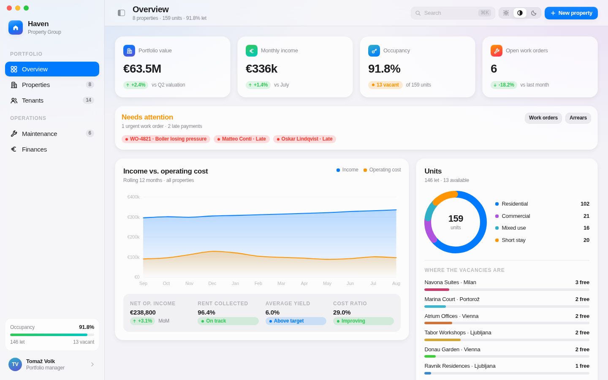

# Haven — property management dashboard

A dummy property-management dashboard designed in the spirit of Apple's Human
Interface Guidelines: system greys and semantic accents, SF-style typography,
translucent chrome, hairline separators, continuous corners and restrained,
ease-out motion.

Everything is fabricated demo data — no real people, buildings or figures.



## Running it

The app is plain HTML, CSS and ES modules — no build step, no dependencies.
ES modules need an HTTP origin, so serve the folder rather than opening the
file directly:

```bash
python3 -m http.server 8000
# then open http://localhost:8000
```

Any static server works (`npx serve`, `php -S`, nginx, GitHub Pages…).

## What's in it

| View | What it shows |
| --- | --- |
| **Overview** | Portfolio KPIs, income vs. operating cost, unit mix, live activity, leases ending soon, highest-yielding buildings, cost structure |
| **Properties** | Card grid with generated artwork per building, type filters, four sort orders, detail sheet |
| **Tenants** | Sortable rent roll with lease countdowns, arrears, payment scores and a per-tenant sheet |
| **Maintenance** | Three-column work-order board by status, priority filter, ticket detail with a timeline |
| **Finances** | NOI bars, cost-structure donut, cash-flow area chart, ledger and per-property rent roll |

Interactions: `⌘K` focuses search, `⌘1`–`⌘5` jump between sections, `Esc`
closes the sheet or clears search, the sidebar collapses, and the appearance
switcher offers Light / System / Dark. Layout is responsive down to phone
width, and everything respects `prefers-reduced-motion`.

## Design system

Tokens live in `assets/styles/tokens.css`:

- **Type** — the SF text scale (large title 34 → caption 12) with Apple's
  negative tracking on display sizes.
- **Colour** — system accents (blue, green, orange, red, purple, teal…) plus
  layered greys and translucent materials, each with a dark-appearance
  counterpart. Light and dark are both defined explicitly, and the `auto`
  setting follows `prefers-color-scheme`.
- **Material** — `backdrop-filter: saturate(180%) blur(20px)` on sidebar,
  toolbar and cards, over hairline `0.5px` borders and a top gloss highlight.
- **Motion** — `cubic-bezier(0.32, 0.72, 0, 1)` at 140/240/420 ms.

## Layout

```
index.html                  app shell: sidebar, toolbar, content outlet, sheet, toast
assets/styles/tokens.css    design tokens (colour, type, spacing, radii, motion)
assets/styles/app.css       layout and components
src/app.js                  routing, view state, appearance, sheet, toast, shortcuts
src/data.js                 fixture portfolio: properties, tenants, work orders, ledger
src/ui.js                   DOM helper + currency/date/percentage formatting
src/components.js           cards, KPI tiles, badges, rows, tables, segmented controls
src/charts.js               hand-rolled SVG area, bar, donut, breakdown and sparkline
src/icons.js                SF-flavoured line icons + generated property artwork
src/views/*.js              one module per view
```

No chart library: the area chart uses Catmull-Rom-to-Bézier smoothing with a
hover readout, and property "photography" is generated as SVG from each
building's hue, so the app ships without a single binary asset.

## Notes

- The fixtures are authored against a fixed reference date (`TODAY` in
  `src/ui.js`, 17 Aug 2026) so lease countdowns always tell the same story.
  Swap it for `new Date()` when the data comes from a real API.
- Formatting is euro/`en-IE`; change `LOCALE` in `src/ui.js` for other markets.
